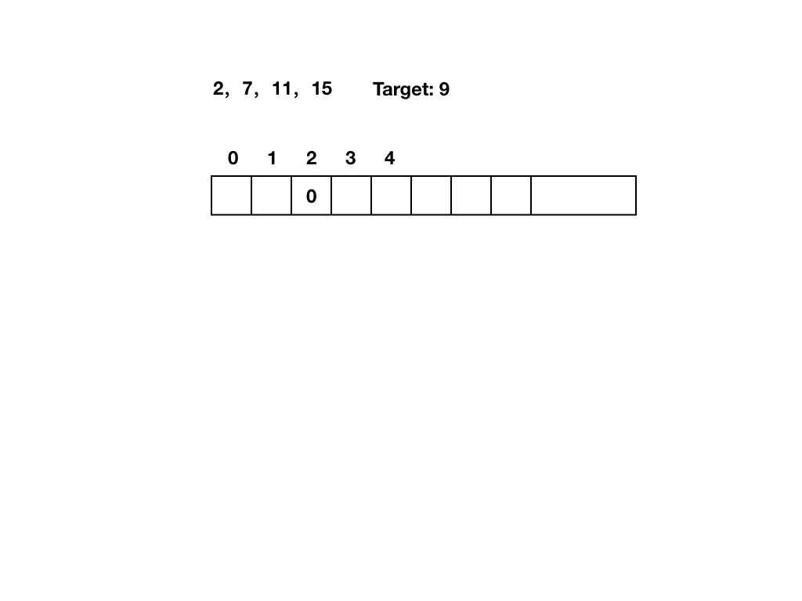

# twoSum
给定一个数组`nums`和一个目标值`target`，求数组中的两个数，使他们的和等于`target`

## 自己代码
我的思路就是$O(n^2)$暴力求解
```
public int[] twoSum(int[] nums, int target) {
        for(int i=0; i<nums.length-1; i++) {
            for (int j = i+1; j<nums.length; j++) {
                if (nums[i] + nums[j] == target) {
                    return new int[]{i,j};
                }
            }
        }
        return null;
    }
```

## 大佬代码
利用`map`数据结构的特性使得一趟遍历就可以解决。`map`的`key`值存放数组中的数字，`value`值存放该数字对应的索引。下图是`for`循环第一轮结束后`map`的状态，第二轮开始时判断`map`中是否含有`9-7=2`这个`key`值，若有，则查找结束，结果索引分别为当前`i`以及`key=2`的`value`值。

不可用数组替换`map`，如果`nums`中的数字过大，会造成数组过长，造成空间浪费
```
public int[] twoSum(int[] nums, int target) {
        int[] result = new int[2];
        Map<Integer, Integer> map = new HashMap<>();
        for (int i=0; i < nums.length; i++) {
            if (map.containsKey(target - nums[i])) {
                result[1] = i;
                result[0] = map.get(target - nums[i]);
                return result;
            }
            map.put(nums[i], i);
        }
        return result;
    }
```